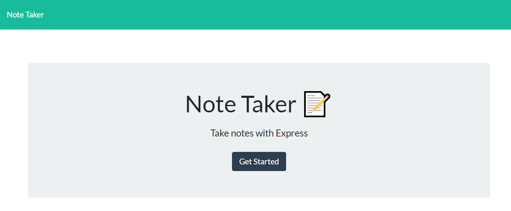

# Note-Taker-App
By Mike Fedele

## Table of Contents 

- [Description](#description)
- [Deployed](#Deployed)
- [Github](#Github)
- [Screenshot](#Screenshot)
- [credits](#credits)
- [license](#license)

## Description

An application to create a team profile with different cards depending on their position on the team. I tested this code using jest. 

## Deployed
[Deployed](https://damp-fjord-83925.herokuapp.com/)

## Github

   
## Screenshot

## Credits
Mike Fedele
Contact me at: mikefid11@gmail.com

## License
MIT License    `${https://img.shields.io/badge/license-MIT-blue}`